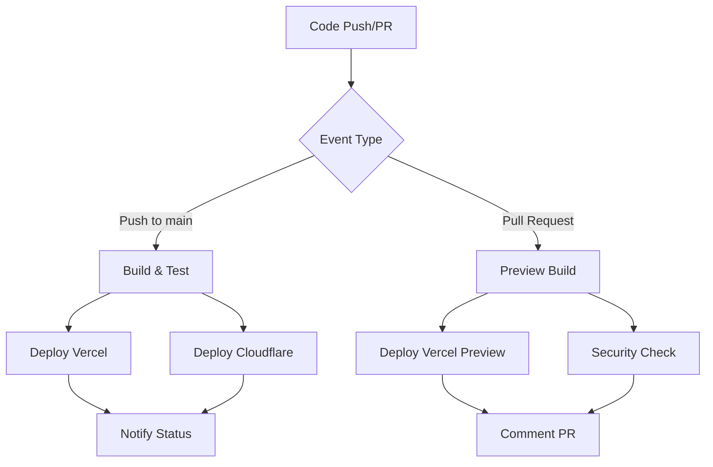

# CI/CD Pipeline Documentation

This document describes the automated CI/CD pipeline for the medical equipment management system with dual deployment to Vercel and Cloudflare Workers.

## 🏗️ Pipeline Overview

The CI/CD pipeline consists of two main workflows:

1. **Dual Platform Deployment** (`deploy-dual.yml`) - Production deployments
2. **Preview Deployment** (`preview-deploy.yml`) - Pull request previews

## 🚀 Production Deployment Workflow

### Triggers
- Push to `main` branch
- Manual workflow dispatch

### Jobs

#### 1. Build & Test (`build-and-test`)
- ✅ Checkout code
- ✅ Setup Node.js 18
- ✅ Install dependencies
- ✅ TypeScript type checking
- ✅ ESLint code linting
- ✅ Build for Vercel

#### 2. Deploy to Vercel (`deploy-vercel`)
- ✅ Deploys to Vercel production
- ✅ Uses existing Vercel configuration
- ✅ Preserves current deployment setup

#### 3. Deploy to Cloudflare Workers (`deploy-cloudflare`)
- ✅ Builds for Cloudflare Workers
- ✅ Deploys to Cloudflare Pages
- ✅ Runs in parallel with Vercel deployment

#### 4. Deployment Notification (`notify-deployment`)
- ✅ Reports deployment status
- ✅ Creates deployment summary
- ✅ Tracks success/failure of both platforms

## 🔍 Preview Deployment Workflow

### Triggers
- Pull request opened/updated to `main` branch

### Jobs

#### 1. Build Preview (`build-preview`)
- ✅ Full build and test cycle
- ✅ Validates code quality

#### 2. Deploy Vercel Preview (`deploy-vercel-preview`)
- ✅ Creates preview deployment on Vercel
- ✅ Comments preview URL on PR

#### 3. Security Check (`security-check`)
- ✅ NPM security audit
- ✅ Bundle size analysis

## 🔧 Required Secrets

Configure these secrets in GitHub repository settings:

### Vercel Secrets
```
VERCEL_TOKEN=your_vercel_token
VERCEL_ORG_ID=your_vercel_org_id
VERCEL_PROJECT_ID=your_vercel_project_id
```

### Cloudflare Secrets
```
CLOUDFLARE_API_TOKEN=your_cloudflare_api_token
CLOUDFLARE_ACCOUNT_ID=your_cloudflare_account_id
```

### Supabase Secrets
```
NEXT_PUBLIC_SUPABASE_URL=https://ltvojwauucztmanidfcb.supabase.co
NEXT_PUBLIC_SUPABASE_ANON_KEY=your_supabase_anon_key
SUPABASE_SERVICE_ROLE_KEY=your_supabase_service_role_key
```

## 📊 Deployment Matrix

| Event | Vercel | Cloudflare Workers | Preview |
|-------|--------|-------------------|---------|
| Push to main | ✅ Production | ✅ Production | ❌ |
| Pull Request | ❌ | ❌ | ✅ Vercel Only |
| Manual Trigger | ✅ Production | ✅ Production | ❌ |

## 🔄 Deployment Flow



## 🚨 Failure Handling

### Partial Deployment Success
- If one platform fails, the other continues
- Deployment summary shows individual status
- Manual intervention may be required

### Complete Deployment Failure
- Both platforms fail
- Check logs for specific errors
- Common issues:
  - Environment variables missing
  - Build errors
  - API token issues

## 🔍 Monitoring & Debugging

### GitHub Actions Logs
- View detailed logs in Actions tab
- Each job shows step-by-step execution
- Download logs for offline analysis

### Platform-Specific Monitoring
- **Vercel**: Vercel Dashboard > Deployments
- **Cloudflare**: Cloudflare Dashboard > Pages

### Common Debug Commands
```bash
# Test builds locally
npm run build:vercel
npm run build:cloudflare

# Preview Cloudflare locally
npm run cf:preview

# Check environment variables
npm run typecheck
```

## 🔧 Maintenance

### Updating Dependencies
- Dependabot automatically creates PRs
- Preview deployments test updates
- Manual approval required for production

### Scaling Considerations
- Parallel deployments minimize total time
- Both platforms share same database
- Real-time features work on both platforms

## 📞 Support

For CI/CD issues:
1. Check GitHub Actions logs
2. Verify secrets configuration
3. Test builds locally
4. Review platform-specific documentation

## 🎯 Performance Benefits

### Dual Deployment Advantages
- **Redundancy**: If one platform fails, the other remains available
- **Performance**: Global distribution via Cloudflare Workers
- **Reliability**: Multiple deployment targets reduce single points of failure
- **Testing**: Preview deployments catch issues early
